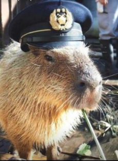
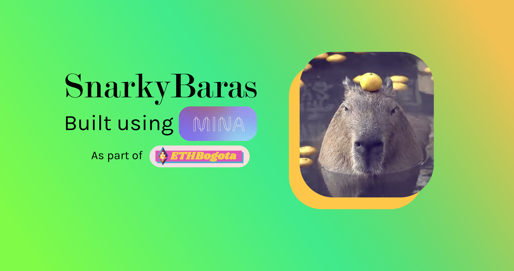
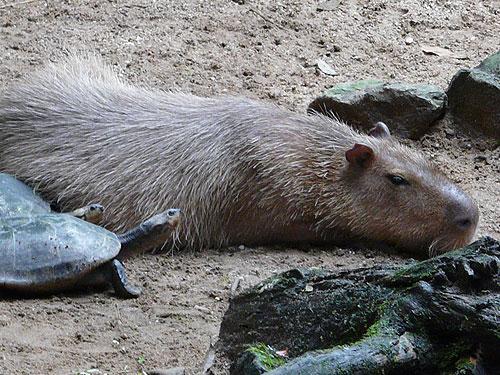

# SnarkyBara

a Zero-knowledge 'Capybara' themed Battleships using SnarkyJS & Mina

Built during the EthBogota 2022 hackathon, this modern twist on a classic bridges the gap between zk-proofs and colombia native species, the capybara.

A never before seen, potentially first ever capybara themed web-based game on Mina.

As forked from the SnarkyJS Sudoku which can be found [here](https://github.com/mitschabaude/snarkyjs-sudoku)